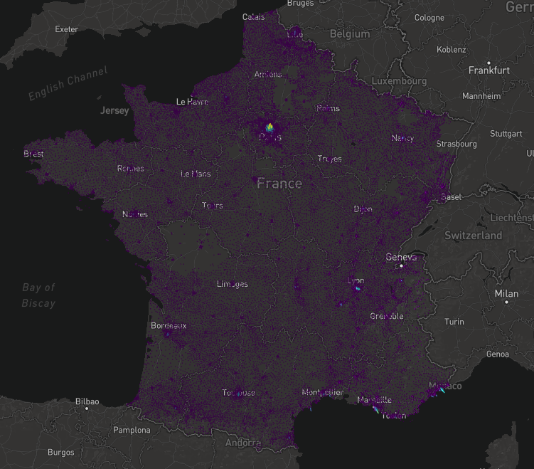
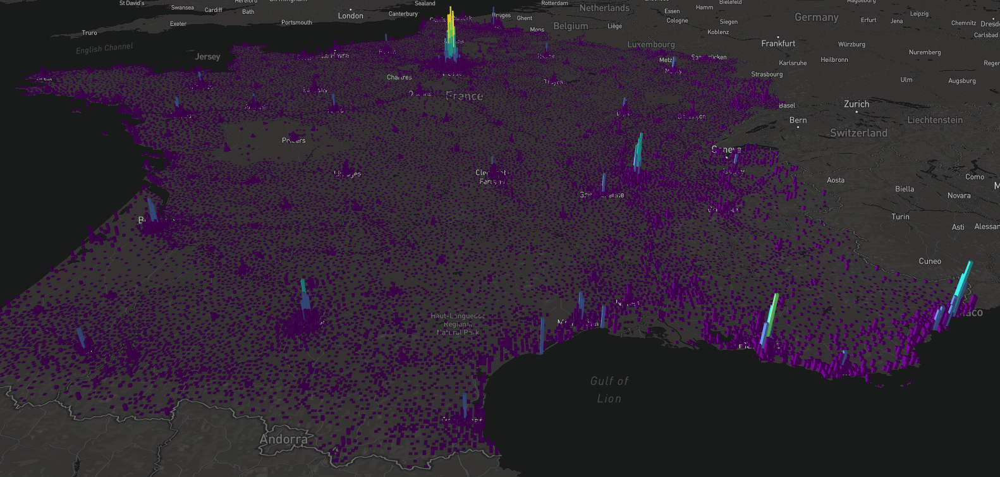
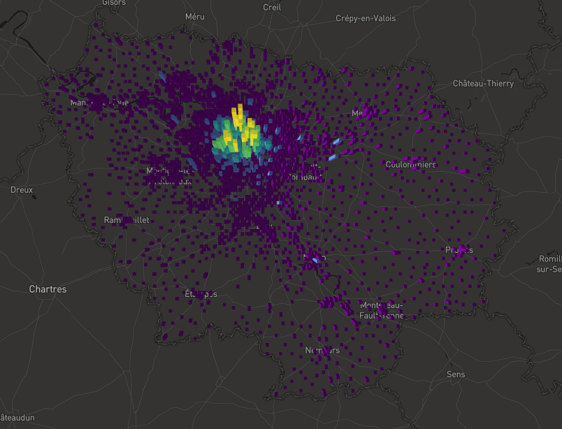
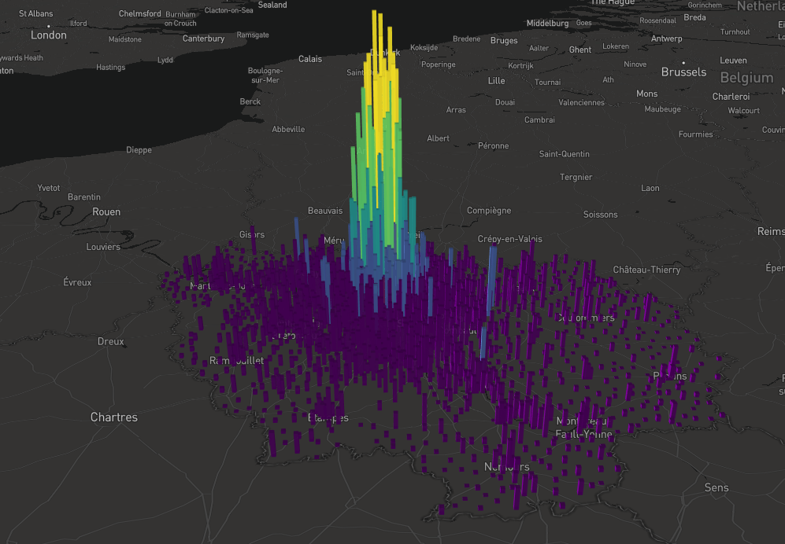
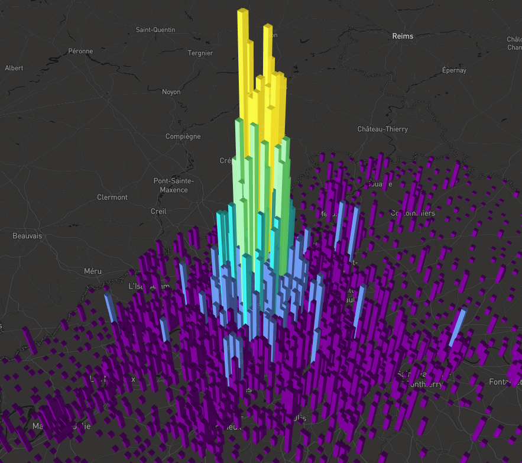

# France power grid

Little experiment with [mapdeck](https://github.com/SymbolixAU/mapdeck) to visualize french housing connected to the electricity grid.

Data from [ENEDIS](https://data.enedis.fr/explore/?sort=modified).

# France

# Ile-de-France

